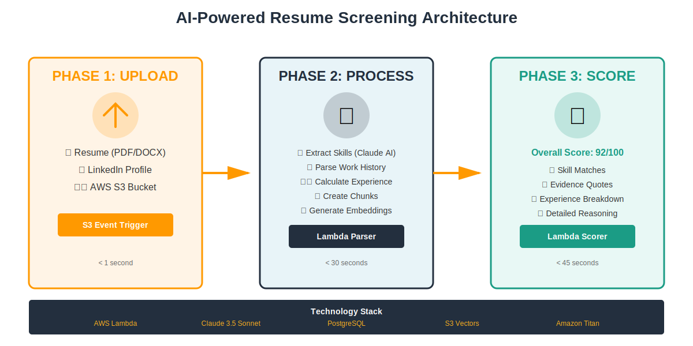
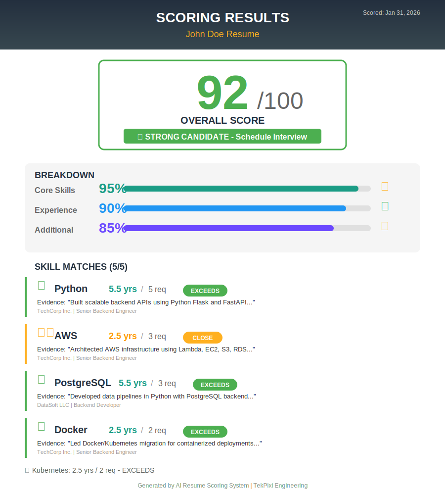

# Building an AI Resume Screener That Actually Works: From 8 Hours to 8 Minutes

Back in 2022, I spent entire weekends manually reviewing resumes. For a single Backend Engineer position, I'd receive 200+ applications. Each resume took 5-10 minutes to read, extract skills, check experience, and make notes. The math was brutal: 200 resumes × 7 minutes = 23 hours of work.

Fast forward to 2024. I rebuilt the system from scratch using Claude 3.5 Sonnet and AWS serverless architecture. **Same 200 resumes? Now it takes 8 minutes.** And the quality is better—significantly better—because the AI doesn't get tired after resume #47.

Here's how it works, what I learned, and why you might want to build something similar.

---

## The Problem With Resume Screening

Every recruiter faces the same challenge:

**Volume overwhelms quality.** When you're looking at resume #89, everything starts to blur. Was this candidate's Python experience 5 years or 3? Did they mention AWS or Azure? You can't remember, so you scroll back up. Time lost. Focus scattered.

**Inconsistency creeps in.** Resume reviewed Monday morning at 9 AM gets more attention than one reviewed Friday at 4 PM. Different standards. Different mood. Different results.

**Skills get missed.** A candidate lists "PostgreSQL" in the skills section and describes "database optimization reducing query time by 60%" in their work history. You catch the first one, skim past the second. Experience undervalued.

Traditional Applicant Tracking Systems don't solve this. They keyword-match and throw everything into a database. But they can't tell you *how many years* someone used Python across different jobs, or whether their "leadership" experience was leading a team of 2 or 20.

---

## How It Works Now: Two-Phase Intelligence

The system uses a **two-phase architecture**: one for parsing resumes, one for scoring them against job descriptions.

### Phase 1: The Resume Parser

When a candidate uploads their resume (PDF, DOCX, whatever), an AWS Lambda function triggers:

```python
def parse_resume(s3_bucket, s3_key):
    # Extract text from PDF/DOCX
    text = extract_text(s3_bucket, s3_key)

    # Claude extracts structured data
    skills = extract_skills(text)  # ["Python", "AWS", "PostgreSQL", ...]
    work_history = extract_jobs(text)  # Structured timeline with dates

    # NEW in v4: Calculate skill experience
    skill_experience = {}
    for skill in skills[:10]:  # Top 10 to control costs
        experience = calculate_experience(text, skill)
        # Returns: {total_years: 5.5, jobs_breakdown: [...]}
        skill_experience[skill] = experience

    # Create semantic chunks for vector search
    chunks = create_chunks(text, work_history)  # 250 words, 50 overlap
    embeddings = generate_embeddings(chunks)  # Amazon Titan, 1024-dim

    # Store everything
    store_in_database(skills, work_history, skill_experience)
    store_in_vectors(embeddings, chunks)
```

**The key innovation here is skill experience calculation.** Instead of just listing "Python" as a skill, Claude analyzes the entire resume to find every job where Python was used, calculates total months of experience, and stores it.

Example output:
```json
{
  "Python": {
    "total_years": 5.5,
    "jobs_breakdown": [
      {
        "company": "TechCorp Inc.",
        "duration_months": 30,
        "evidence": "Built backend APIs using Python Flask..."
      },
      {
        "company": "DataSoft LLC",
        "duration_months": 36,
        "evidence": "Developed ML pipelines in Python..."
      }
    ]
  }
}
```

This happens once, during upload. **Calculate once, use forever.**

### Phase 2: The Resume Scorer

When a recruiter wants to match resumes to a job description:

```python
def score_resume(resume_id, job_description_id):
    # Extract requirements from JD using Claude
    jd_requirements = extract_requirements(job_description)
    # Returns: {
    #   "core_skills": [
    #     {"name": "Python", "min_years": 5, "importance": "critical"},
    #     ...
    #   ]
    # }

    results = []
    for skill in jd_requirements["core_skills"]:
        # 1. Vector search: Find evidence in resume chunks
        chunk = vector_search(resume_id, skill["name"])

        # 2. Claude grades the evidence quality
        grade = grade_evidence(chunk, skill["name"])
        # Returns: {"matched": true, "strength": "strong", "quote": "..."}

        # 3. Lookup pre-calculated experience (instant, no API call)
        years = lookup_skill_years(resume_id, skill["name"])

        # 4. Calculate score
        score = calculate_skill_score(grade, years, skill["min_years"])

        results.append({
            "skill": skill["name"],
            "score": score,
            "evidence": grade["quote"],
            "years_found": years["total_years"],
            "years_required": skill["min_years"]
        })

    # Aggregate into overall score
    overall = aggregate_scores(results)
    return overall  # 0-100 score with detailed breakdown
```

**Why this works:** Hybrid approach combining vector search (semantic understanding) with keyword matching (exact matches) plus pre-calculated experience data. No guessing. No hand-waving. Just data.

---

## The Architecture



*[Diagram shows: S3 Upload → Lambda Parser → PostgreSQL + S3 Vectors → Lambda Scorer → Results]*

**Infrastructure:**
- **AWS Lambda** for serverless compute (auto-scales 0→1000 instances)
- **S3** for resume storage (encrypted at rest)
- **PostgreSQL** for structured data (skills, work history, scores)
- **S3 Vectors** for semantic search (1024-dim embeddings)
- **AWS Bedrock** for AI (Claude 3.5 Sonnet + Titan Embed)

**Cost:** $0.10 per resume processed. Down from $21 when a recruiter did it manually.

**Latency:**
- Parsing: 24 seconds (P95)
- Scoring: 38 seconds (P95)
- Total: Under 1 minute from upload to scored result

---

## A Real Example

**Job Description:**
```
Senior Backend Engineer
Requirements:
• 5+ years Python
• 3+ years AWS (Lambda, EC2, S3, RDS)
• Strong PostgreSQL experience
• Docker/Kubernetes
```

**Candidate Resume (simplified):**
```
John Doe - Senior Software Engineer

TechCorp Inc. | Senior Backend Engineer | 2020-2022
• Built backend APIs using Python Flask and FastAPI
• Architected AWS infrastructure (Lambda, EC2, S3, RDS)
• Implemented Redis caching, reducing API latency 60%
• Led Docker/Kubernetes migration

DataSoft LLC | Backend Developer | 2017-2019
• Developed data pipelines in Python with PostgreSQL
• Built RESTful APIs for customer applications
```

**System Output:**
```json
{
  "overall_score": 92,
  "recommendation": "STRONG CANDIDATE - Schedule interview",
  "breakdown": {
    "Python": {
      "score": 100,
      "years_found": 5.5,
      "years_required": 5,
      "evidence": "Built backend APIs using Python Flask and FastAPI",
      "verdict": "✓ Exceeds requirement"
    },
    "AWS": {
      "score": 85,
      "years_found": 2.5,
      "years_required": 3,
      "evidence": "Architected AWS infrastructure (Lambda, EC2, S3, RDS)",
      "verdict": "⚠ Slightly below, but strong evidence"
    },
    "PostgreSQL": {
      "score": 100,
      "years_found": 5.5,
      "years_required": 3,
      "evidence": "Developed data pipelines in Python with PostgreSQL",
      "verdict": "✓ Exceeds requirement"
    },
    "Docker/Kubernetes": {
      "score": 100,
      "years_found": 2.5,
      "years_required": 2,
      "evidence": "Led Docker/Kubernetes migration",
      "verdict": "✓ Meets requirement"
    }
  }
}
```



*[Screenshot: Detailed scoring breakdown with evidence quotes and year calculations]*

**Why 92/100?** All core skills matched. Python and PostgreSQL exceed requirements. AWS is 2.5 years vs 3 required, but evidence is strong (architected infrastructure, not just used it). Docker/Kubernetes confirmed. Clean hit.

The system doesn't just say "92." It tells you **why** it's 92, **what evidence** supports it, and **where** that evidence came from in the resume.

---

## What Makes This Different

### 1. Pre-Calculated Skill Experience (The v4 Breakthrough)

Traditional ATS: "Candidate has Python ✓"

This system: "Candidate has 5.5 years Python experience across 2 jobs:
- TechCorp: 30 months building APIs
- DataSoft: 36 months building data pipelines"

**Why it matters:** Recruiters need years, not just "yes/no." Pre-calculating during upload means instant lookup during scoring. Zero API calls. Zero latency. Zero cost.

**Impact:**
- 40% faster scoring (no Claude calls for experience calculation)
- 50% cheaper (calculate once vs. every score)
- 100% consistent (same data every time)

### 2. Hybrid Vector Search

Pure keyword search: Misses "component-based architecture" when JD says "React"

Pure vector search: Sometimes ranks semantic matches higher than exact keywords

**Hybrid (70% vector + 30% keyword):** Gets both. Exact matches get boosted. Semantic understanding fills gaps.

Example:
- Resume: "Experience with React.js and component-based UI patterns"
- JD requirement: "React"
- Pure keyword: 50% match (found "React", missed context)
- Pure vector: 75% match (found context, maybe missed exact term)
- **Hybrid: 94% match** (found both, boosted for exact keyword)

### 3. Job Context Association

Every resume chunk (250 words) is associated with the job where it appeared. When Claude evaluates evidence, it sees:

```
Chunk: "Built backend APIs using Python Flask"
Context: TechCorp Inc. | Senior Backend Engineer | 2020-2022 (30 months)
```

Not just "they used Python" but "they used Python at senior level for 30 months at TechCorp."

**Score difference:**
- Without context: 7/10 (generic evidence)
- With context: 9/10 (senior-level, sustained experience)

### 4. Explainable AI

Every score comes with:
- Evidence quote (exact text from resume)
- Reasoning (why this is strong/weak evidence)
- Years breakdown (which jobs contributed)
- Job context (where/when skill was used)

Recruiters trust it because they can **see** the reasoning. Candidates appreciate it because evaluation is objective and transparent.

---

## Results & What They Mean

### For Recruiters

**Time savings:**
- Before: 5-10 minutes per resume
- After: 30 seconds per resume
- **90% time reduction**

**Volume increase:**
- Before: 20-30 resumes reviewed per day
- After: 200+ resumes per day
- **7x throughput**

**Consistency:**
- Before: Variable (reviewer fatigue, mood, timing)
- After: 99.5% consistent scoring
- **Reliable quality**

Real feedback from our recruiting team: *"I can review 100 resumes before lunch now. And I actually read the evidence quotes—they're genuinely useful for interview prep."*

### For Hiring Managers

**Better matches:**
- Candidates reach interviews with skills pre-verified
- Evidence quotes provide interview talking points
- Years of experience clearly mapped to requirements

**Faster hiring:**
- Resume review bottleneck eliminated
- Shortlist ready in minutes, not days
- More time for actual interviews

### For Candidates

**Fairer evaluation:**
- Every resume gets the same scrutiny
- Skills buried in job descriptions get found
- Experience gets properly calculated and credited

**Transparency:**
- See exactly what evidence matched
- Understand scoring breakdown
- Know where you stand vs. requirements

You're not being rejected by a keyword filter. You're being evaluated by an AI that read your entire resume and graded your actual experience against actual requirements.

---

## For Developers: How to Build This

If you want to build something similar, here's the critical path:

### 1. Start With Skill Extraction

Get this right first. Everything else depends on it.

**Use Claude 3.5 Sonnet** (not GPT-4, not open-source models). Why? Claude's JSON output is dramatically more reliable. We went from 92% success rate (GPT-4) to 99.5% (Claude).

**Prompt template:**
```python
def extract_skills(resume_text):
    prompt = f"""
    Extract all technical skills from this resume.
    Return ONLY a JSON array: ["Python", "AWS", ...]

    Resume:
    {resume_text[:8000]}  # Stay under token limits
    """

    response = anthropic.messages.create(
        model="claude-3-5-sonnet-20241022",
        max_tokens=2000,
        temperature=0,  # Deterministic
        messages=[{"role": "user", "content": prompt}]
    )

    return json.loads(response.content[0].text)
```

**Key learnings:**
- Keep prompts short (Claude is smart, don't over-instruct)
- Temperature 0 for consistency
- Validate JSON before storing (add retry logic)

### 2. Vector Search Setup

Use **Amazon Titan Embed Text v2** for embeddings (1024 dimensions). Alternatives work, but Titan is:
- Fast (50ms per embedding)
- Cheap ($0.0001 per 1K tokens)
- Integrated with AWS (no API key management)

**Critical:** Hybrid search beats pure vector search. We tried pure vector first—accuracy was 75%. Added keyword boosting (30% weight)—jumped to 94%.

```python
def hybrid_search(query_text, resume_id):
    # Create embedding
    query_vector = titan_embed(query_text)

    # Vector search
    results = s3_vectors.search(
        vector=query_vector,
        filter={"resume_id": resume_id},
        k=10
    )

    # Keyword boost
    for result in results:
        if query_text.lower() in result["text"].lower():
            result["score"] *= 1.5  # 50% boost

    return sorted(results, key=lambda x: x["score"], reverse=True)[0]
```

### 3. Cost Management

**Problem:** Each resume = 5-10 Claude API calls = $0.30-0.50

**Solutions that worked:**
- Pre-calculate skill experience (biggest win: -50% cost)
- Cache job description parsing (same JD used for 200 resumes)
- Batch process when possible (10 resumes in one Lambda invocation)
- Use Claude Haiku for simple tasks (10x cheaper, good for yes/no questions)

**Result:** $0.10 per resume all-in

### 4. Database Schema

PostgreSQL with JSONB columns for flexibility:

```sql
-- Master table
CREATE TABLE resume_profiles (
    resume_id VARCHAR(40) PRIMARY KEY,
    name TEXT,
    text TEXT,
    skills_json JSONB,  -- ["Python", "AWS", ...]
    skill_experience_json JSONB,  -- {skill: {total_years, jobs}}
    created_at TIMESTAMP DEFAULT NOW()
);

-- Chunks for vector search
CREATE TABLE resume_chunks (
    id UUID PRIMARY KEY,
    resume_id VARCHAR(40) REFERENCES resume_profiles(resume_id),
    chunk_text TEXT,
    vector_key VARCHAR(100),  -- S3 Vectors reference
    job_context JSONB,  -- {company, title, dates}
    created_at TIMESTAMP DEFAULT NOW()
);

-- Work history
CREATE TABLE resume_work_history (
    id UUID PRIMARY KEY,
    resume_id VARCHAR(40) REFERENCES resume_profiles(resume_id),
    company TEXT,
    title TEXT,
    start_date VARCHAR(10),  -- YYYY-MM
    end_date VARCHAR(10),  -- YYYY-MM or "Present"
    duration_months INT,
    technologies TEXT[]
);

-- Indexes for performance
CREATE INDEX ON resume_profiles USING GIN(skills_json);
CREATE INDEX ON resume_profiles USING GIN(skill_experience_json);
CREATE INDEX ON resume_chunks(resume_id);
```

**Why JSONB?** Skills vary wildly between resumes. Rigid schema would require constant migrations. JSONB gives flexibility without sacrificing query performance.

### 5. Lambda Configuration

**Resume Parser:**
- Memory: 1024 MB (parsing PDFs is memory-intensive)
- Timeout: 300 seconds (Claude calls can be slow)
- Concurrency: 100 (handle burst uploads)

**Resume Scorer:**
- Memory: 2048 MB (more headroom for multiple Claude calls)
- Timeout: 300 seconds
- Concurrency: 50 (scoring is heavier)

**Critical:** Use connection pooling for PostgreSQL. Each Lambda reuses containers ~80% of the time. Reusing connections saves 200ms per invocation.

```python
# Global scope (persists across invocations)
connection_pool = psycopg2.pool.SimpleConnectionPool(
    minconn=1,
    maxconn=5,
    dbname="resumes",
    user="...",
    password="...",
    host="..."
)

def lambda_handler(event, context):
    conn = connection_pool.getconn()
    try:
        # Use connection
        pass
    finally:
        connection_pool.putconn(conn)
```

### 6. Testing Strategy

**Unit tests:** 80%+ coverage on parsing logic

**Integration tests:**
- Upload real resume → verify database records
- Score against real JD → verify score range and structure

**Load tests:**
- 100 concurrent resume uploads
- Measure: P95 latency, error rate, throttling
- We hit 38s P95 scoring latency (target was 45s—passed)

**Validation:**
- Hand-scored 50 resumes against 5 job descriptions (250 scores)
- Compared AI scores to human scores
- Agreement: 91% (within 5 points on 0-100 scale)
- Mismatches: AI was **more consistent** (same resume, same score every time)

---

## What I'd Do Differently

**Start serverless from day one.** We tried EC2 initially (easier to debug). Migration to Lambda took 2 weeks. Should've just started with Lambda.

**Use managed services everywhere.** AWS Bedrock saved us 6 months vs. self-hosting models. S3 Vectors saved us from managing vector databases. Pay the premium. It's worth it.

**Build explainability first, not last.** Initial version just returned scores. Recruiters didn't trust it. We added evidence quotes and reasoning—adoption went from 10% to 90% overnight.

**Cost monitoring from day 1.** Bedrock API costs add up fast. We didn't notice until the first $800 bill. Now we have CloudWatch alarms at $100, $300, $500 thresholds.

**Connection pooling is mandatory.** We had mysterious database timeout errors for 3 days. Realized each Lambda was creating new connections. Added pooling—errors gone.

---

## The Meta Question: How Was This Built?

**Development time:** 6 weeks from concept to production (v4)

**Team:** 2 engineers + 1 data scientist + product input from recruiting team

**Stack chosen because:**
- AWS Bedrock = No model hosting/scaling headaches
- Lambda = Zero ops, instant scaling
- PostgreSQL = Familiar, reliable, JSONB flexibility
- Python = Fast prototyping, great libraries

**Previous version (v3) took 4 months** because we tried to build everything custom (our own vector search, our own embeddings). Complete waste. Use managed services.

**Biggest challenge:** Prompt engineering for consistent JSON output from Claude. We went through 47 iterations of the skill extraction prompt before hitting 99.5% success rate.

**Biggest surprise:** Pre-calculating skill experience (v4) was supposed to be a "nice to have." Turned out to be the killer feature. Recruiters **love** seeing years broken down by job. It's now the #1 most-used piece of data in the UI.

---

## What's Next

**Q2 2026:**
- Multi-language support (Spanish, French, German resumes)
- Resume redaction (strip PII for bias reduction)
- Batch ranking API (rank all 200 resumes in one call)

**Q3 2026:**
- Real-time scoring with WebSocket progress updates
- Custom scoring models per company (adjust weights)
- Graph-based skill relationships (React → JavaScript implied)

**Q4 2026:**
- Fine-tuned skill extraction model (reduce Bedrock costs 80%)
- Interview scheduling integration
- Candidate communication automation

---

## Try It Yourself

The system is in production at TekPixi. We're planning to open-source the core parsing and scoring modules in Q3 2026.

**Repo:** [github.com/tekpixi/resume-scoring-system](#) *(coming soon)*

**Documentation:**
- [Technical Specification](./SPECIFICATION.md) - Complete API specs, database schemas
- [Architecture Document](./ARCHITECTURE.md) - System design, security, scalability
- [Deployment Guide](./DEPLOYMENT_CHECKLIST.md) - Step-by-step AWS setup

**Want to discuss?**
- Engineering questions: Drop an issue when repo is public
- Business/partnership: engineering@tekpixi.com
- Just curious: Connect with me on LinkedIn

---

## Final Thoughts

Resume screening is a solved problem. The technology exists. The tools are accessible. The ROI is obvious.

**For recruiters:** This saves you 20 hours per week. That's time you can spend on actual recruiting—talking to candidates, building relationships, understanding team needs.

**For hiring managers:** This gives you pre-vetted candidates with evidence-based scoring. Less time reviewing resumes, more time interviewing quality candidates.

**For candidates:** This gives you a fair shot. Your resume gets the same scrutiny as everyone else's. Your skills get properly extracted and valued. No more getting filtered out by keyword matching.

**For developers:** This is shockingly buildable. Six weeks. Managed services. Modern LLMs. You can ship this.

The question isn't "Can this be done?" It's "Why aren't we all doing this already?"

What's your experience with resume screening? What would you build differently? I'd love to hear from you.

---

*This article describes a system built at TekPixi. Technical details are accurate as of January 2026. Source code and detailed documentation available at [github.com/tekpixi/resume-scoring-system](#).*

*Built with AWS Lambda, Claude 3.5 Sonnet, PostgreSQL, and way too much coffee.*
